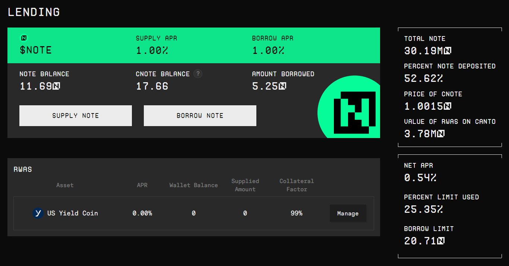
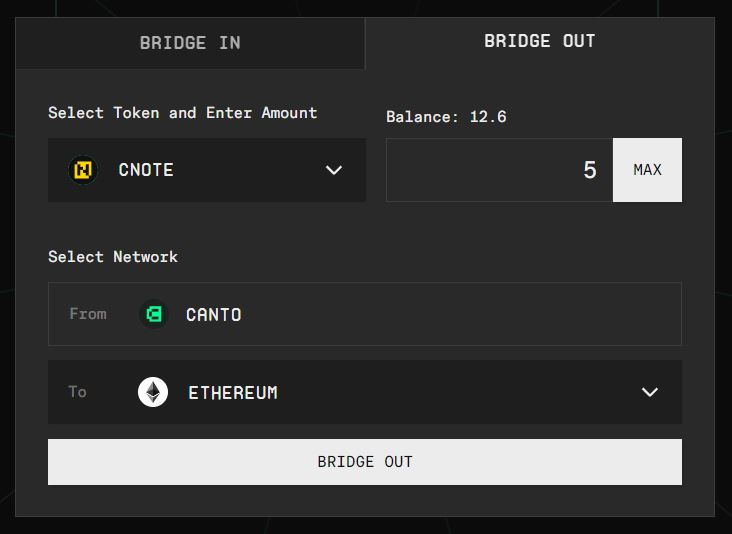

# Beta Interface

The beta interface at [**beta.canto.io**](https://beta.canto.io/) supports novel assets and protocols deployed for Canto's neofinance ecosystem. Specifically, the interface allows you to supply RWAs, borrow and supply $NOTE, and deposit LP tokens to earn incentives.

## Lending

The lending interface at [**beta.canto.io/lending**](https://beta.canto.io/lending) can be used to permissionlessly supply $NOTE, in exchange for which users receive $cNOTE. It can also used to supply RWAs and borrow $NOTE.

<figure><figcaption></figcaption></figure>

### Supplying $NOTE

To supply $NOTE to the Canto Lending Market (and receive $cNOTE), follow these steps:

1. Click on the `SUPPLY NOTE` button and enter the amount you wish to supply.
2. Click `CONFIRM` and confirm the transaction in your wallet.

If you don't already have $NOTE, it can be obtained in the following ways:

* Bought from the Canto DEX (via a frontend like [Slingshot](https://slingshot.finance/))
* Borrowed against stablecoins such as USDC and USDT
* Borrowed against RWAs

### Borrowing $NOTE

To borrow $NOTE from the Canto Lending Market, first supply an eligible collateral asset. Then, follow these steps:

1. Click on the `BORROW NOTE` button and enter the amount you wish to borrow.
2. Click `CONFIRM` and confirm the transaction in your wallet.

### Supplying RWAs

Whitelisted parties who have purchased RWAs on Canto can supply them to the Canto Lending Market. To do so, follow these steps:

1. Next to the RWA you wish to supply, click on the `Manage` button.
2. On the `SUPPLY` tab, enter the amount you wish to supply.
3. Click `CONFIRM` and confirm the transaction in your wallet.

## LP Rewards

The LP interface at [**beta.canto.io/lp**](https://beta.canto.io/lp) can be used to supply liquidity to trading pairs on the Canto DEX and Ambient Finance. It supports the same LP pairs as the previous canto.io interface, with the addition of the neofinance-specific $cNOTE<>$USDC pair on Ambient Finance.

<figure><figcaption></figcaption></figure>

### Providing Liquidity

To provide liquidity for the $cNOTE<>$USDC pair, follow these steps:

1. Click on `Add LP` next to the $cNOTE<>$USDC pair.
2. Enter an amount for one of the assets.
3. Click `Add Liquidity` and confirm the transactions in your wallet.

For this pair, the concentrated liquidity range eligible for incentives is automatically selected when providing liquidity.

For all other pairs, which use the Canto DEX, liquidity is provided [without price bounds](../free-public-infrastructure-fpi/dex.md#incentivized-pools).

## Bridging

The bridging interface at [**beta.canto.io/bridge**](https://beta.canto.io/bridge) can be used to bridge assets to and from Canto via Gravity Bridge, LayerZero, and IBC. In addition to assets already supported by the [alpha bridging interface](https://canto.io/bridge), it supports bridging of $cNOTE to Ethereum via LayerZero.

To bridge $cNOTE, follow these steps:

<figure><figcaption></figcaption></figure>

1. Select the `BRIDGE OUT` tab and choose $cNOTE.
2. Enter an amount and click the `BRIDGE OUT` button.
3. Confirm the transactions in your wallet to approve $cNOTE for transfer and begin bridging.
