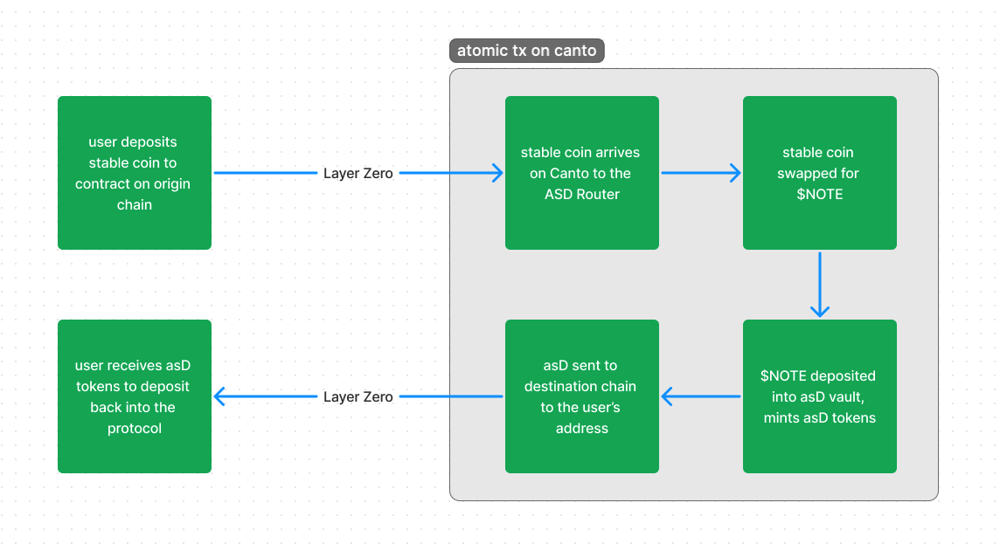

# asdRouter

[`asdRouter`](https://github.com/Plex-Engineer/ASD-V2/blob/main/contracts/asd/asdRouter.sol) enables asD tokens to be minted from other chains with USDC deposits. Its only public method, `lzCompose`, is called by the LayerZero executor when minting is initiated by a user on another network.

<figure><figcaption></figcaption></figure>

## Minting

To mint asD tokens from another network, the user should send USDC to the LayerZero endpoint on that network. The `_message` must be formatted as bytes with the form of the OFTComposeMessage struct:

```solidity
struct OftComposeMessage {
    uint32 _dstLzEid; // destination endpoint id
    address _dstReceiver; // receiver on destination
    address _dstAsdAddress; // asD address on destination
    address _cantoAsdAddress; // asD on Canto (where to mint asD from)
    uint256 _minAmountASD; // minimum amount (slippage for swap)
    address _cantoRefundAddress; // canto refund address
    uint256 _feeForSend; // fee for bridge to destination chain
}
```

## Methods

### `lzCompose`

The `lzCompose(...)` method is called by the LayerZero executor when minting is initiated on another network. The calldata for this method is determined by the message sent on the origin chain, as described above.

This method:

1. Wraps bridged USDC as asdUSDC
2. Swaps asdUSDC for NOTE on Ambient
3. Mints the specified asD token on Canto
4. Sends the asD token to the destination chain and address
