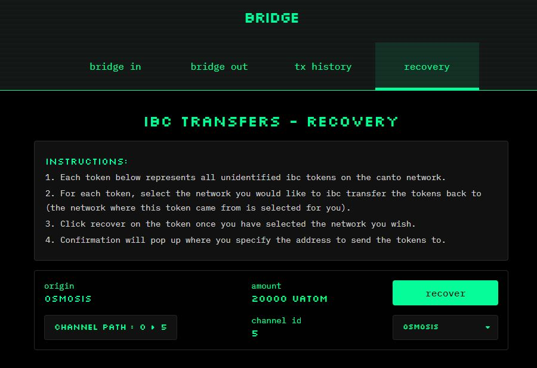

# IBC Token Recovery

IBC tokens from Cosmos SDK chains such as ATOM, GRAV, and OSMO can only be bridged to the Canto EVM if they were transferred to Canto from their native chain. While the [**app.canto.io**](https://app.canto.io/bridge) frontend ensures this, _manual_ IBC transfers may result in these and other unsupported tokens being sent to Canto.

To retrieve these assets, use the IBC token recovery tool:

<figure><figcaption></figcaption></figure>

1. Navigate to [**app.canto.io/bridge**](https://app.canto.io/bridge) and select the `recovery` tab. **This tab will only be visible if the connected wallet contains assets not supported by the Canto EVM.**
2. Click the `recover` button next to the asset you would like to retrieve. Optionally, users can override which network the asset will be sent to, although this is not advised.
3. In the modal that appears, enter your address on the receiving network and click `confirm`:

<figure><figcaption></figcaption></figure>
