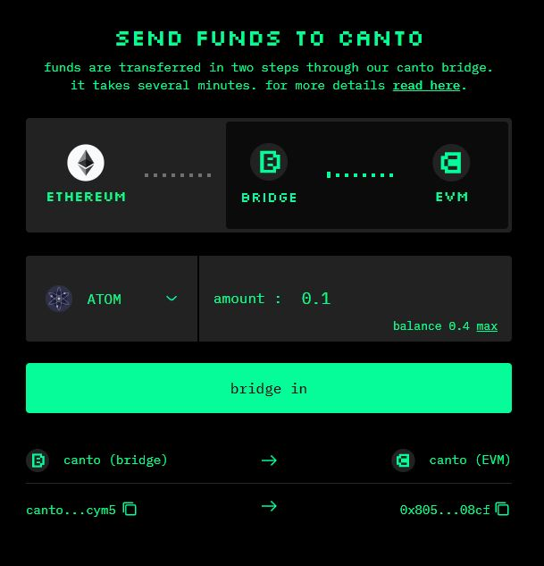
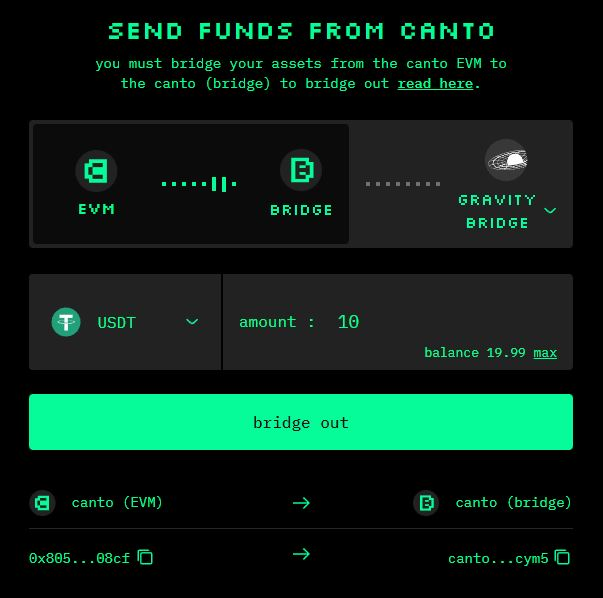

# Bridge and EVM

**There are two Canto ledgers: the Canto Bridge and the Canto EVM.** Depending on what you want to do on Canto, you may need to convert assets from one chain to the other**.**

If you have just bridged from Ethereum or Cosmos, your assets are on the Canto Bridge blockchain. To use the Canto Lending Market, Canto DEX, and other DApps, you must bridge your assets to the Canto EVM.

If your assets are already on the Canto EVM but you would like to bridge them back to Ethereum or Cosmos, you must first bridge them to the Canto Bridge blockchain.


**To bridge assets between the Canto Bridge and Canto EVM, you must have at least 2.3 $CANTO in your MetaMask wallet.** If necessary, you can request a drip from the #social-faucet channel in the [Canto Discord](https://discord.com/invite/canto).


## Canto Bridge to EVM

1. Navigate to [**canto.io/bridge**](https://canto.io/bridge) **** and toggle the selector to show the flow of assets from the Canto Bridge to the Canto EVM.
2. Select the token you would like to bridge and input the quantity. Quantities less than 1 must include a 0 in the ones place value (e.g. `0.99`).
3. Click `bridge in` and sign the message in your wallet:

<figure><figcaption></figcaption></figure>

## Canto EVM to Bridge

1. Navigate to [**canto.io/bridge**](https://canto.io/bridge) and select the `bridge out` tab. Ensure the selector shows the flow of assets from the Canto EVM to the Canto Bridge.
2. Select the token you would like to bridge and input the quantity. Quantities less than 1 must include a 0 in the ones place value (e.g. `0.99`).
3. Click `bridge out` and sign the message in your wallet:

<figure><figcaption></figcaption></figure>
