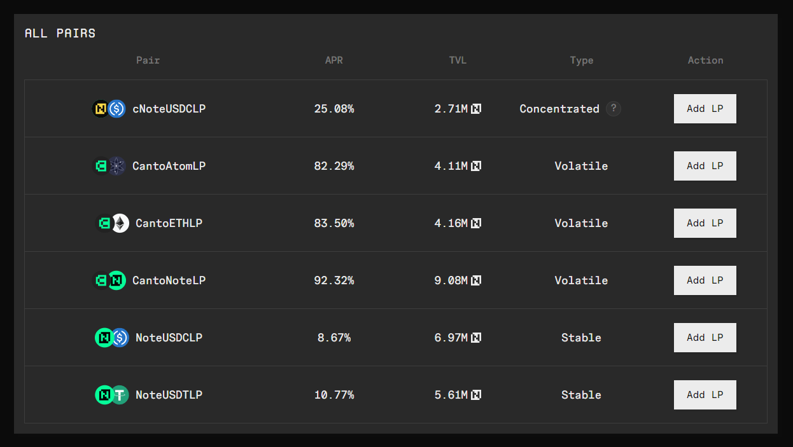

# Cosmos Hub -> Canto

At present, the Cosmos Hub -> Canto bridge only supports $ATOM by means of IBC transfer.


**Do not attempt to transfer $ATOM to the Canto address in your Keplr wallet. Follow the instructions below.**


## Cosmos Hub -> Canto 

To bridge $ATOM from the Cosmos Hub network to the Canto Network, follow these steps:

1. Navigate to [**bridge.canto.io**](https://bridge.canto.io) **** and connect your MetaMask wallet, making sure you are on the Ethereum network.
2. **Before bridging assets to Canto, you will be asked to generate a Canto public key, which is associated with your Ethereum address. You will only need to do this once per wallet. This is so you can sign Cosmos transactions from that Ethereum address. There is no interaction with private keys.**&#x20;

.png>)

3\. Add the Canto network to your Keplr wallet.

.png>)

4\. Copy your Canto native address.

.png>)

5\. Make sure "Show Advanced IBC Transfers" option is toggled on in Keplr wallet settings.

6\. In Keplr, switch to the Cosmos Hub. Then click IBC Transfer.

.png>)

7\. Select “Canto Mainnet” as the destination chain. If bridging for the first time, add Canto by clicking "New IBC Transfer Channel", selecting Canto Mainnet and entering `channel-358.`

.png>).png>)

8\. Enter the amount you want to transfer and complete the transaction. Your $ATOM should arrive after a few minutes.

Assets bridged to Canto will arrive on the native Canto blockchain. If you want to use the Canto Lending Market, Canto DEX, and other DApps, you must [convert your assets to the Canto EVM](../converting-assets.md).

