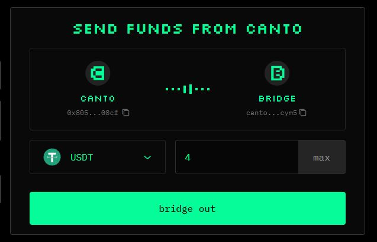
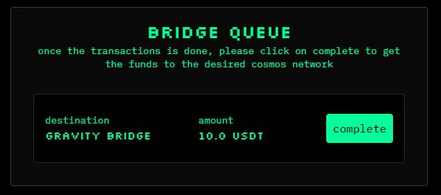

# Bridging From Canto

With the [**canto.io**](https://canto.io/bridge) frontend, you can bridge from Canto to Ethereum (via Gravity Bridge) or to Cosmos Hub and other IBC-enabled chains. To ensure smooth bridging, assets can only be bridged to their native chains.

## To Ethereum via Gravity Bridge 

Bridging from Canto to Ethereum is possible via Gravity Bridge. To bridge assets on Canto back to Ethereum, you must have an IBC wallet such as Keplr in addition to your Ethereum wallet.

To bridge from Canto to Ethereum, you'll need to move your assets to the Canto Bridge first:

1. Navigate to [**canto.io/bridge**](https://canto.io/bridge) and select the `bridge out` tab.
2. Select an Ethereum-native token you would like to bridge and input the quantity.
3. Click `bridge out` and sign the message in your Ethereum wallet:

<figure><figcaption></figcaption></figure>

### Bridge Queue 

After moving your assets to the Canto Bridge, finish the bridging process by clicking the `complete` button next to your bridge transaction under the _Bridge Queue_ section:

<figure><figcaption></figcaption></figure>

A modal will appear prompting you to input a Gravity Bridge address. Now, follow these steps:

1. Open your Keplr wallet and change the network to Gravity Bridge.
2. Copy your Gravity Bridge address and paste it into the bridge interface.
3. Click `confirm` and sign the message in your Ethereum wallet.
4. After a few minutes, the assets will arrive in your Keplr wallet. If desired, you can now bridge from Gravity Bridge to Ethereum using the [Gravity Bridge portal](https://bridge.blockscape.network/).

## To Cosmos Hub and Other IBC Chains

To bridge from Canto to Cosmos Hub or other IBC chains, you'll need to move your assets to the Canto Bridge first:

1. Navigate to [**canto.io/bridge**](https://canto.io/bridge) and select the `bridge out` tab.
2. Select the token you would like to bridge and input the quantity.
3. Click `bridge out` and sign the message in your Ethereum wallet:

<figure><figcaption></figcaption></figure>

### Bridge Queue 

After moving your assets to the Canto Bridge, finish the bridging process by clicking the `complete` button next to your bridge transaction under the _Bridge Queue_ section:

<figure><figcaption></figcaption></figure>

A modal will appear prompting you to input an address for the asset's native chain. Now, follow these steps:

1. Open your Keplr wallet and change the network to the asset's native chain.
2. Copy your address for that chain and paste it into the bridge interface.
3. Click `confirm` and sign the message in your Ethereum wallet.
4. After a few minutes, the assets will arrive in your Keplr wallet.
