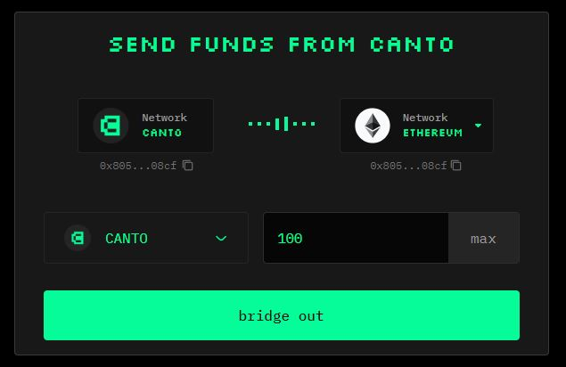
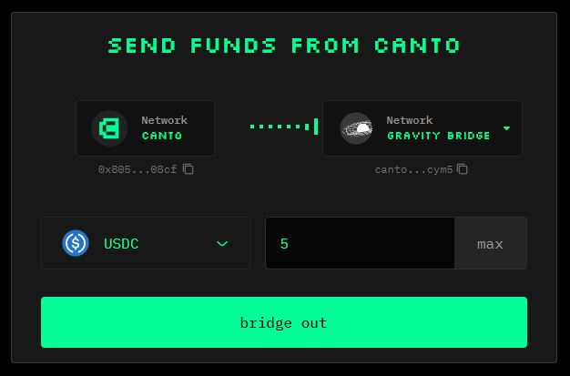
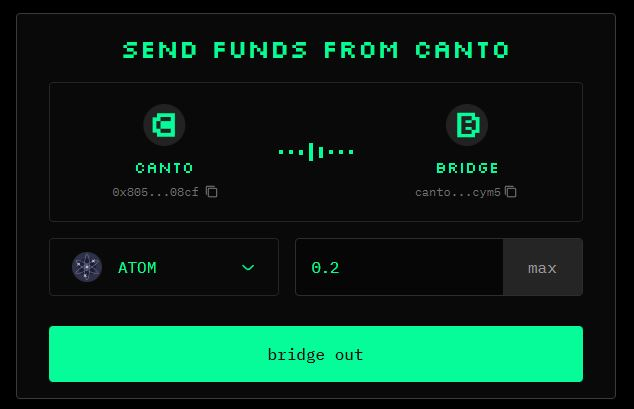
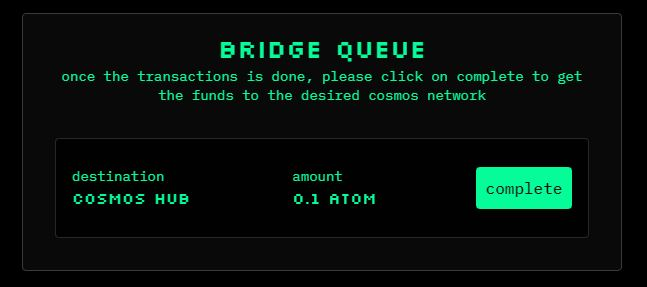

# Bridging from Canto

With the [**canto.io**](https://canto.io/bridge) frontend, you can bridge from Canto to Ethereum or to Cosmos Hub and other IBC-enabled chains. To ensure smooth bridging, assets can only be bridged to their native chains.


cNOTE can also be bridged from Canto via LayerZero using the [beta interface](https://docs.canto.io/neofinance/beta-interface).


## Bridge Canto to Ethereum (via LayerZero) 

CANTO can be bridged directly from Canto to Ethereum via LayerZero. Aside from an Ethereum wallet such as MetaMask, this path requires no additional wallets or tooling.

To bridge CANTO from Canto to Ethereum, follow these steps:

1. Navigate to [**canto.io/bridge**](https://canto.io/bridge) and select the `bridge out` tab.
2. Select CANTO and input the quantity.
3. Click `bridge out` and confirm the two transactions in your Ethereum wallet:

<figure><figcaption></figcaption></figure>

## Bridge ERC20s To Ethereum (via Gravity Bridge) 

ERC20 tokens like WETH, USDC, and USDT can be bridged from Canto to Ethereum via Gravity Bridge. To do so, you must have an IBC wallet such as Keplr in addition to your Ethereum wallet.

To bridge from Canto to Ethereum, you'll need to move your assets to the Gravity Bridge first:

1. Navigate to [**canto.io/bridge**](https://canto.io/bridge) and select the `bridge out` tab.
2. Select Gravity Bridge as the destination network.
3. Select an Ethereum-native token you would like to bridge and input the quantity.
4. Click `bridge out` and enter the Gravity Bridge address from your Keplr Wallet.
5. Click `confirm` and sign the messages in your Ethereum wallet.

<figure><figcaption></figcaption></figure>

You can now bridge from Gravity Bridge to Ethereum using the [Gravity Bridge portal](https://bridge.blockscape.network/).

## Bridge IBC Tokens To Cosmos Chains

To bridge from Canto to Cosmos Hub or other IBC chains, you'll need to move your assets to the Canto Bridge first:

1. Navigate to [**canto.io/bridge**](https://canto.io/bridge) and select the `bridge out` tab.
2. Select the token you would like to bridge and input the quantity.
3. Click `bridge out` and sign the message in your Ethereum wallet:

<figure><figcaption></figcaption></figure>

### Bridge Queue 

After moving your assets to the Canto Bridge, finish the bridging process by clicking the `complete` button next to your bridge transaction under the _Bridge Queue_ section:

<figure><figcaption></figcaption></figure>

A modal will appear prompting you to input an address for the asset's native chain. Now, follow these steps:

1. Open your Keplr wallet and change the network to the asset's native chain.
2. Copy your address for that chain and paste it into the bridge interface.
3. Click `confirm` and sign the message in your Ethereum wallet.
4. After a few minutes, the assets will arrive in your Keplr wallet.
