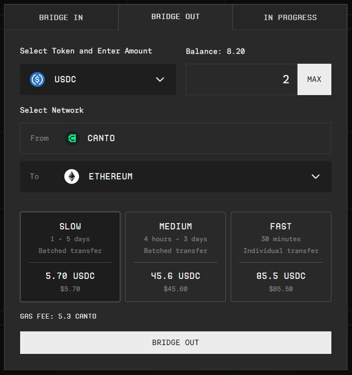
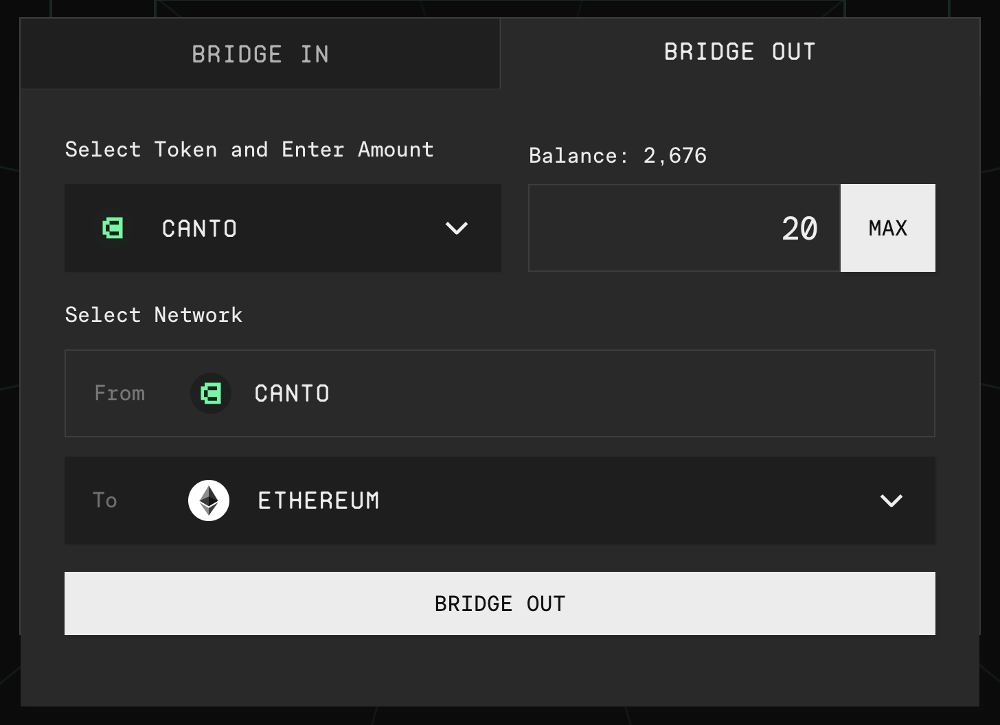
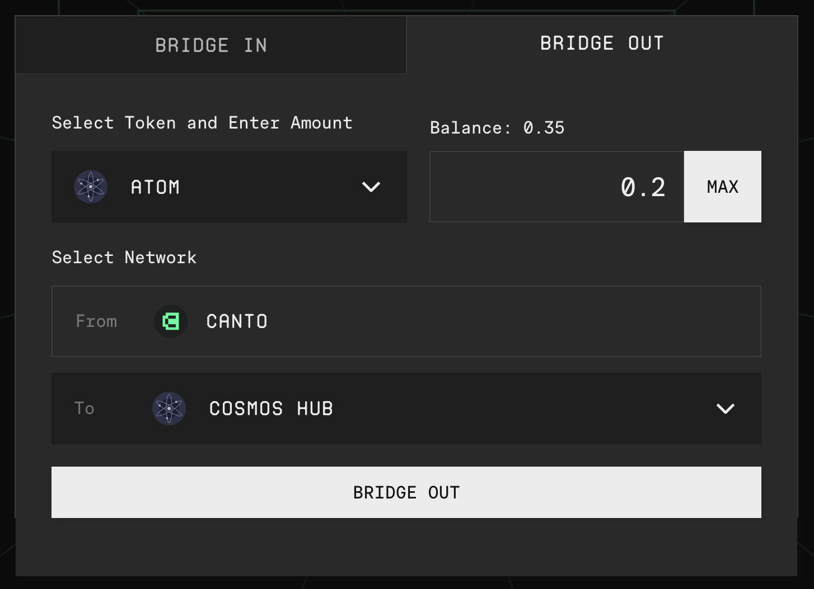

# Bridging from Canto

With the [**canto.io**](https://canto.io/bridge) frontend, you can bridge from Canto to Ethereum or to Cosmos Hub and other IBC-enabled chains. To ensure smooth bridging, assets can only be bridged to their native chains.

## Bridge ERC20s To Ethereum 

ERC20 tokens like WETH, USDC, and USDT can be bridged from Canto to Ethereum via Gravity Bridge. As of January 2024, a Cosmos wallet such as Keplr is no longer needed if your EVM wallet supports custom chains.

To bridge, follow the steps below:



_**Only follow these instructions if your EVM wallet supports custom chains e.g. MetaMask. If you are unsure, use the Legacy Flow.**_

1. Navigate to [**canto.io/bridge**](https://canto.io/bridge) and select the _Bridge Out_ tab.
2. Select an Ethereum-native asset and input the quantity.
3. Choose a bridging speed and click _Bridge Out_.
4. When prompted, confirm that you are using a supported wallet.
5. Sign the messages in your Ethereum wallet.
6. Between signing messages, accept the prompts to switch networks to Gravity Bridge and then back to Canto as they appear.

<figure><figcaption></figcaption></figure>



_**The Legacy Flow supports all EVM wallets. However, you must have a Cosmos wallet compatible with the Gravity Bridge network, such as**_ [_**Keplr**_](https://www.keplr.app/)_**.**_

1. Navigate to [**canto.io/bridge**](https://canto.io/bridge) and select the Bridge Out tab.
2. Select an Ethereum-native asset and input the quantity.
3. Choose a bridging speed and click Bridge Out.
4. Select _Use Gravity Bridge Portal._
5. Enter the Gravity Bridge address shown in your Keplr wallet.
6. Sign the messages in your Ethereum wallet.

Funds will arrive at your Gravity Bridge address within several minutes. To complete the process of bridging to Ethereum, navigate to [**bridge.blockscape.network**](https://bridge.blockscape.network/).



## Bridge Canto/cNOTE to Ethereum (via LayerZero) 

CANTO and cNOTE can be bridged directly from Canto to Ethereum via LayerZero. Aside from an Ethereum wallet such as MetaMask, this path requires no additional wallets or tooling.

To bridge CANTO or cNOTE from Canto to Ethereum, follow these steps:

1. Navigate to [**canto.io/bridge**](https://canto.io/bridge) and select the _Bridge Out_ tab.
2. Select the asset you wish to bridge and input the quantity.
3. Click _Bridge Out_ and confirm the transactions in your Ethereum wallet:

<figure><figcaption></figcaption></figure>

## Bridge IBC Tokens To Cosmos Chains 

To bridge from Canto to Cosmos Hub or other IBC chains, you'll need to move your assets to the Canto Bridge first:

1. Navigate to [**canto.io/bridge**](https://canto.io/bridge) and select the _Bridge Out_ tab.
2. Select the asset you wish to bridge and input the quantity.
3. Click _Bridge Out_ and enter the address for the asset's native chain from your Keplr Wallet.
4. Confirm and sign the messages in your Ethereum wallet.

<figure><figcaption></figcaption></figure>
