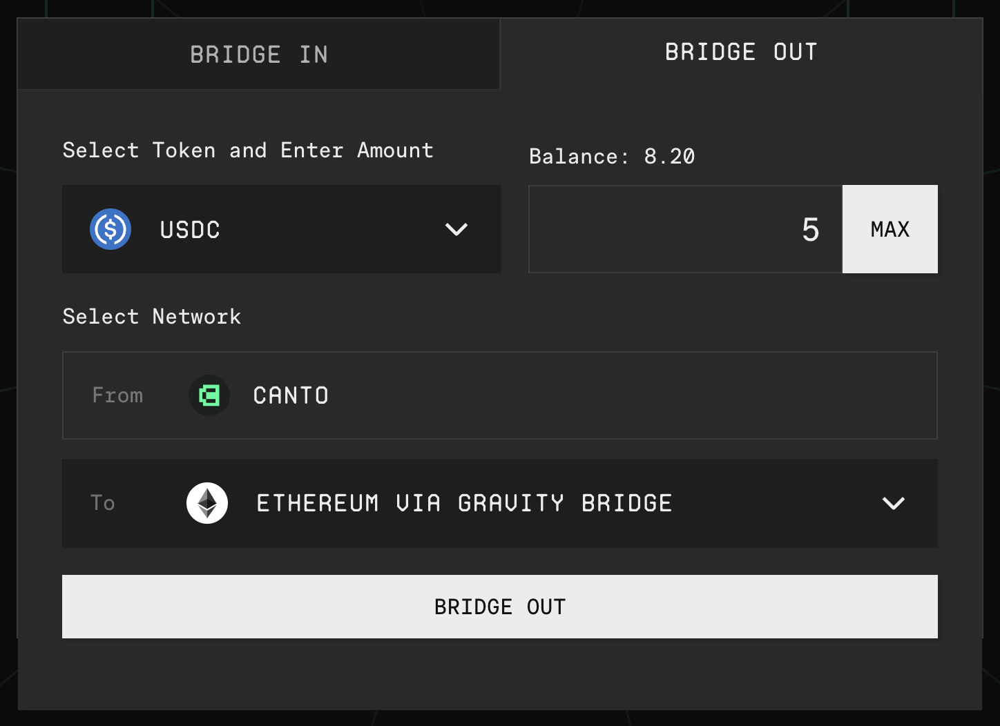

# Bridging from Canto

With the [**canto.io**](https://canto.io/bridge) frontend, you can bridge from Canto to Ethereum or to Cosmos Hub and other IBC-enabled chains. To ensure smooth bridging, assets can only be bridged to their native chains.

## Bridge To Ethereum via Gravity Bridge

ERC20 tokens like WETH, USDC, and USDT can be bridged from Canto to Ethereum via Gravity Bridge. To do so, **you must have an IBC wallet such as Keplr** in addition to your Ethereum wallet.

To bridge from Canto to Ethereum, you'll need to move your assets to the Gravity Bridge first:

1. Navigate to [**canto.io/bridge**](https://canto.io/bridge) and select the `BRIDGE OUT` tab.
2. Select the Ethereum-native asset you wish to bridge and input the quantity.
3. Click `BRIDGE OUT` and enter the Gravity Bridge address from your Keplr or other IBC wallet.
4. Confirm and sign the messages in your Ethereum wallet.

<figure><figcaption></figcaption></figure>

To finish bridging to Ethereum, connect your Keplr or other IBC wallet to the [Gravity Bridge portal](https://bridge.blockscape.network/) and follow these steps:

1. Ensure Gravity Bridge is selected as the origin network and Ethereum is selected as the destination network.
2. Select the asset you wish to bridge and input the quantity.
3. Enter your Ethereum address.
   1. Click `Begin transfer` and confirm the transactions in your IBC wallet.

## Bridge Canto/cNOTE o Ethereum (via LayerZero)

CANTO and cNOTE can be bridged directly from Canto to Ethereum via LayerZero. Aside from an Ethereum wallet such as MetaMask, this path requires no additional wallets or tooling.

To bridge CANTO or cNOTE from Canto to Ethereum, follow these steps:

1. Navigate to [**canto.io/bridge**](https://canto.io/bridge) and select the `BRIDGE OUT` tab.
2. Select the asset you wish to bridge and input the quantity.
3. Click `BRIDGE OUT` and confirm the transactions in your Ethereum wallet:

<figure><figcaption></figcaption></figure>

## Bridge IBC Tokens To Cosmos Chains

To bridge from Canto to Cosmos Hub or other IBC chains, you'll need to move your assets to the Canto Bridge first:

1. Navigate to [**canto.io/bridge**](https://canto.io/bridge) and select the `BRIDGE OUT` tab.
2. Select the asset you wish to bridge and input the quantity.
3. Click `BRIDGE OUT` and enter the address for the asset's native chain from your Keplr Wallet.
4. Confirm and sign the messages in your Ethereum wallet.

<figure><figcaption></figcaption></figure>
