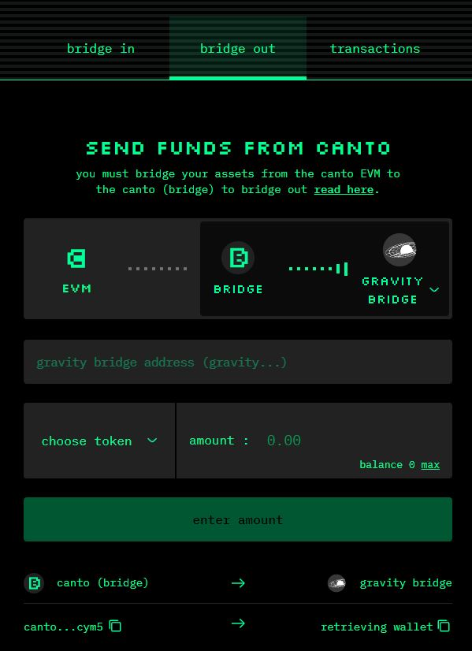
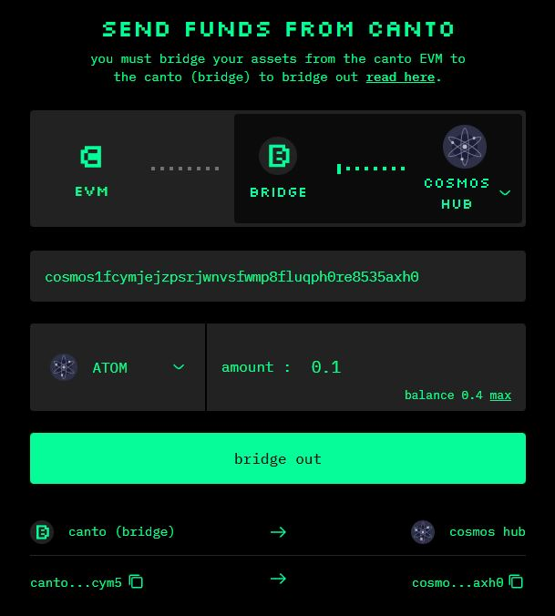

# Bridging From Canto

To bridge from Canto to Ethereum, Cosmos Hub, or Gravity Bridge, make sure you have [moved your assets from the Canto EVM to the Canto Bridge](bridge-vs-evm.md). Then, follow the steps below.

## To Ethereum/Gravity Bridge 

Bridging from Canto to Ethereum is possible via Gravity Bridge. To bridge assets on Canto back to Ethereum, you must have:

* An IBC wallet (such as Keplr Wallet)
* An Ethereum wallet such as MetaMask

Once you are ready to bridge from Canto to Ethereum, follow these steps:

1. Navigate to [**canto.io/bridge**](https://canto.io/bridge), select the `bridge out` tab, and toggle the selector to show the flow of assets from the Canto Bridge to Gravity Bridge:

<figure><figcaption></figcaption></figure>

2\. Open your Keplr wallet and change the network to Gravity Bridge. Copy your Gravity Bridge address and paste it into the bridge interface.

3\. Select a token and enter the amount.

4\. Click `bridge out` and sign the transaction in MetaMask. After a few minutes, you should see the tokens in your Keplr wallet at the address you provided.

5\. Once the tokens are in your Keplr wallet, bridge from Gravity Bridge to Ethereum using the [Gravity Bridge portal](https://bridge.blockscape.network/).

## To Cosmos Hub

To bridge from Canto to Cosmos Hub, follow these steps:

1. Navigate to [**canto.io/bridge**](https://canto.io/bridge), select the `bridge out` tab, and toggle the selector to show the flow of assets from the Canto Bridge to Cosmos Hub:

<figure><figcaption></figcaption></figure>

2\. Open your Keplr wallet, copy your Cosmos Hub address, and paste it into the bridge interface.

3\. Enter the amount of $ATOM you would like to bridge. Only bridging of $ATOM from Canto to Cosmos Hub is supported at this time.

4\. Click `bridge out` and sign the transaction in MetaMask. After a few minutes, you should see the tokens in your Keplr wallet at the address you provided.
