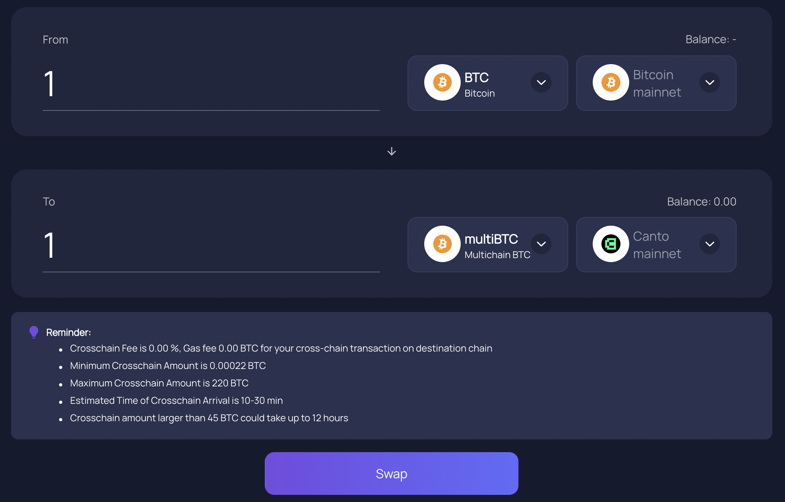

# Multichain

[Multichain](https://app.multichain.org) (formerly Anyswap) supports bridging between Canto and numerous other blockchains, including Ethereum, Bitcoin, Polygon, Optimism, and others.

## Using Multichain

The Multichain bridging process is identical regardless of whether you are bridging to or from Canto. To use the bridge, follow these steps:

1. Navigate to [**https://app.multichain.org**](https://app.multichain.org/#/router) **** and connect your wallet.
2. Under the _From_ section, select the network you would like to bridge from, as well as the asset you would like to send and its amount.
3. Under the _To_ section, select the network you would like to bridge to (e.g. Canto) and the asset you would like to receive.
4. Finally, click the _Swap_ button. If necessary, approve the outgoing asset before confirming the bridge transaction in your wallet to initiate the bridging process:

<figure><figcaption></figcaption></figure>


When bridging from Bitcoin mainnet, you will need to make the outgoing transaction manually. After clicking _Swap_, a pop-up window shows the address you should transfer funds to in order to initiate the bridging process.


## Supported Assets

Multichain supports the following assets on Canto:

* $ACS
* $BIFI
* $LQDR
* $TAROT
* $multiBTC
