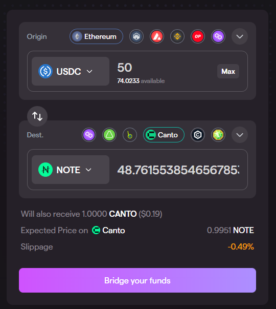

# Synapse Bridge

[Synapse Bridge](https://synapseprotocol.com/) is a multichain bridge that enables on-chain asset swaps between Canto and 10+ other blockchains, including Ethereum, Polygon, Optimism, Arbitrum, Avalanche, BNB Chain, and others.

## Using Synapse Bridge

The Synapse bridging process is identical regardless of whether you are bridging to or from Canto. To use the bridge, follow these steps:

1. Navigate to [**https://synapseprotocol.com/**](https://synapseprotocol.com/) and connect your wallet.
2. Under the _Origin_ section, select the network you would like to bridge from, as well as the asset you would like to send and its amount.
3. Under the _Dest._ section, select the network you would like to bridge to (e.g. Canto) and the asset you would like to receive.
4. If necessary, click the _Approve_ button and confirm the transaction in your wallet to approve the outgoing asset.
5. Finally, click the _Bridge your funds_ button and confirm the transaction in your wallet to initiate the bridging process:

<figure><figcaption></figcaption></figure>

## Supported Assets

The Synapse Bridge supports the following assets on Canto:

* $USDC
* $USDT
* $NOTE
* $nUSD
* $SYN

### Swap Routing

To ensure deep liquidity when bridging to and from Canto, the Synapse Bridge performs direct cross-chain swaps for just two assets:

* [$nUSD](https://docs.synapseprotocol.com/reference/faq#synapse-bridge) – Synapse's stablecoin bridge asset
* [$SYN](https://docs.synapseprotocol.com/reference/faq#the-syn-token) – Synapse's governance and incentive token

To send and receive other stablecoins on Canto, the Synapse Bridge swaps to and from $nUSD using chain-specific stableswap pools on the origin and destination chains.

Synapse's [Canto Stableswap Pool](https://synapseprotocol.com/pools/canto2pool) consists of $nUSD and $NOTE, enabling users to bridge stablecoins across chains and swap to and from Canto's native unit of account in a single interaction.

Additionally, the Synapse Bridge integrates the [Canto DEX](../../free-public-infrastructure-fpi/dex.md) for its feeless $USDC <> $NOTE and $USDT <> $NOTE liquidity. This means that users can bridge to and from $USDC and $USDT on Canto in a single interaction, via $nUSD and $NOTE.

For more information about how the Synapse Bridge works, see the [Synapse Protocol documentation](https://docs.synapseprotocol.com/).
