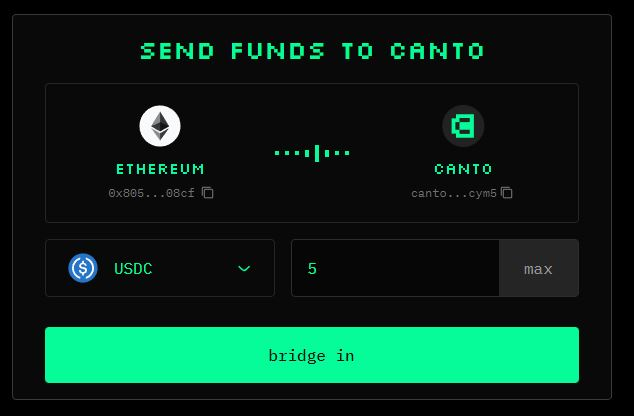
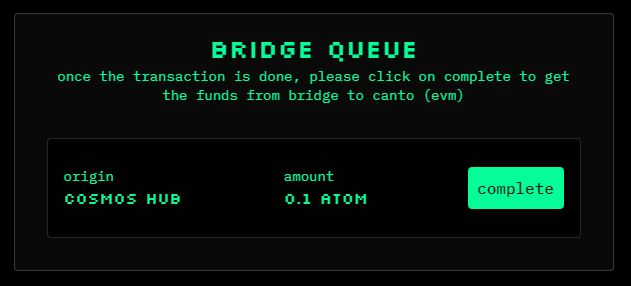

# Bridging to Canto

With the [**canto.io**](https://canto.io/bridge) frontend, you can natively bridge to Canto from Ethereum, Cosmos Hub, and other IBC-enabled chains. Once bridged, you'll be able to move assets to the Canto EVM and begin interacting with Canto's Free Public Infrastructure and DApps.

## Bridge Tokens From Ethereum

At present, the Ethereum bridge supports WETH, USDC, USDT, and wstETH transfers (via Gravity Bridge) and CANTO transfers (via LayerZero). To bridge assets from the Ethereum network to the Canto network, follow these steps:

1. Navigate to [**canto.io/bridge**](https://canto.io/bridge) and connect your MetaMask wallet on the Ethereum network.
2. If bridging to Canto for the first time, **generate a Canto public key** by clicking on the red banner at the top of the page and signing the message with your wallet.
3. Select the token you would like to bridge and input the quantity.
4. Click `bridge in` and confirm the transaction(s) in your wallet. In addition to the bridge transaction, you may need to confirm transactions to wrap ETH and/or approve the token.

<figure><figcaption></figcaption></figure>

### Bridge Queue 

CANTO bridged to Canto via LayerZero will arrive on the Canto _EVM_ within several minutes.

ERC20 assets including WETH, USDC, USDT, and wstETH bridged to Canto via Gravity Bridge will arrive on the Canto _Bridge_ approximately 20 minutes after the Ethereum transaction is confirmed.

To finish bridging ERC20 assets to the Canto EVM, click the `complete` button next to your bridge transaction under the _Bridge Queue_ section:

<figure><figcaption></figcaption></figure>

## Bridge IBC Tokens From Cosmos Chains

IBC transfers can be used to bridge selected assets including ATOM, GRAV, and OSMO to Canto from Cosmos Hub and other IBC-enabled chains.

**To ensure the assets you bridge in can be used on the Canto EVM, use the** [**canto.io**](https://canto.io/bridge) **frontend to initiate IBC transfers:**

1. Navigate to [**canto.io/bridge**](https://canto.io/bridge) and connect your MetaMask wallet on the Ethereum network.
2. If bridging to Canto for the first time, **generate a Canto public key** by clicking on the red banner at the top of the page and signing the message with your wallet.
3. Select the IBC token you would like to bridge. This will prompt a Keplr popup asking you to unlock your wallet, connect to the token's native network, and add the Canto network (if necessary).
4. In the IBC transfer modal that appears, enter the amount you would like to bridge, click `IBC IN`, and confirm the transaction in Keplr:

<figure><figcaption></figcaption></figure>

### Bridge Queue 

Assets bridged from IBC-enabled chains to Canto will arrive on the Canto Bridge several minutes after the IBC transfer is submitted.

To finish bridging to the Canto EVM, click the `complete` button next to your bridge transaction under the _Bridge Queue_ section:

<figure><figcaption></figcaption></figure>

Supported IBC Assets

* SOMM
* GRAV
* AKT
* OSMO
* CRE
* KAVA
* INJ\*
* CMDX
* DVPN
* EVMOS\*
* XPRT
* stkATOM
* STRD
* stEVMOS
* stATOM
* stJUNO
* stOSMO
* stSTARS
* QCK
* qATOM
* qREGEN
* qSTARS

\*limited compatibility with canto.io – see [Manual IBC Transfer](to-canto.md#manual-ibc-transfer).

Manual IBC Transfer

Advanced users may wish to initiate IBC transfers manually. Before doing so, ensure the token you are transferring is one of the [Supported IBC Assets](to-canto.md#supported-ibc-assets) and that you are bridging the token from its native chain.

**Do not attempt to IBC transfer tokens to the Canto address in your Keplr wallet. Follow the instructions below.**

1. Navigate to [**canto.io/bridge**](https://canto.io/bridge) and connect your MetaMask wallet on the Ethereum network.
2. If bridging to Canto for the first time, **generate a Canto public key** by clicking on the red banner at the top of the page and signing the message with your wallet.
3. Open the sidebar by clicking the burger icon in the top-left corner of the page and click `add to keplr` to add the Canto network to Keplr.
4. Copy your Canto native address from the center of the page.
5. Make sure the "Show Advanced IBC Transfers" option is toggled on in Keplr wallet settings.
6. Switch to the chain you are trying to bridge from and click `IBC Transfer`.
7. Select _Canto Mainnet_ as the destination chain.
8. **If bridging for the first time, add Canto by clicking "New IBC Transfer Channel" and selecting Canto Mainnet. Enter the correct channel for the chain you are bridging from.**
   * Cosmos Hub: `channel-358`
   * Gravity Bridge: `channel-88`
   * Kava: `channel-87`
   * Akash: `channel-59`
   * Osmosis: `channel-550`
   * Injective: `channel-99`
   * Comdex: `channel-58`
   * Crescent: `channel-34`
   * Sommelier: `channel-2`
   * Sentinel: `channel-71`
   * Evmos: `channel-62`
   * Persistence: `channel-80`
   * Stride: `channel-74`
   * Quicksilver: `channel-24`
9. Enter the amount you want to transfer and complete the transaction. Your tokens should arrive after a few minutes.

After performing a manual IBC transfer, your assets will arrive on the Canto Bridge. Use the [Bridge Queue](to-canto.md#bridge-queue-ibc) at [**canto.io/bridge**](https://canto.io/bridge) to finish bridging to the Canto EVM.

