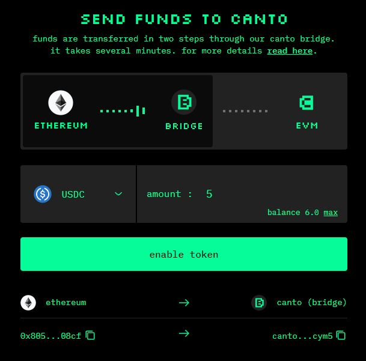
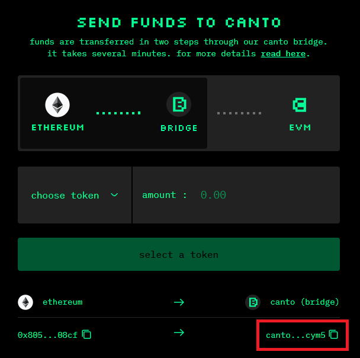

# Bridging to Canto

You can natively bridge to Canto from Ethereum, Cosmos Hub, or Gravity Bridge. Once you've bridged, you'll be able to [move assets to the Canto EVM](bridge-vs-evm.md) and begin interacting with Canto's Free Public Infrastructure and DApps.

## From Ethereum

At present, the Ethereum <-> Canto bridge supports ETH, USDC, and USDT transfers. To bridge assets from the Ethereum network to the Canto network, follow these steps:

1. Navigate to [**canto.io/bridge**](https://canto.io/bridge) and connect your MetaMask wallet, making sure you are on the Ethereum network.
2. Before bridging to Canto, **generate a Canto public key** by clicking on the red banner at the top of the page and signing the transaction in your wallet.
3. 3\. Select the token you would like to bridge and input the quantity. Quantities less than 1 must include a 0 in the ones place value (e.g. `0.99`).
4. Confirm the approval transaction in your wallet to approve transfer of the asset to the bridge.
5. Sign the message in your wallet to confirm the transfer.

<figure><figcaption></figcaption></figure>

Assets bridged to Canto will arrive on the native Canto blockchain 96 ETH blocks (20 minutes) after the Ethereum transfer is confirmed. If you want to use the Canto Lending Market, Canto DEX, and other DApps, you must [bridge your assets to the Canto EVM](bridge-vs-evm.md).

## From Cosmos Hub


**Do not attempt to transfer $ATOM to the Canto address in your Keplr wallet. Follow the instructions below.**


To bridge $ATOM from the Cosmos Hub network to the Canto Network, follow these steps:

1. Navigate to [**canto.io/bridge**](https://canto.io/bridge) **** and connect your MetaMask wallet, making sure you are on the Ethereum network.
2. Before bridging to Canto, **generate a Canto public key** by clicking on the red banner at the top of the page and signing the transaction in your wallet.
3. In the sidebar, click the `add to keplr` button:

<figure><figcaption></figcaption></figure>

4\. Copy your Canto native address:

<figure><figcaption></figcaption></figure>

5\. Make sure "Show Advanced IBC Transfers" option is toggled on in Keplr wallet settings.

6\. In Keplr, switch to the Cosmos Hub. Then click IBC Transfer.

.png>)

7\. Select “Canto Mainnet” as the destination chain. If bridging for the first time, add Canto by clicking "New IBC Transfer Channel", selecting Canto Mainnet and entering `channel-358.`

.png>).png>)

8\. Enter the amount you want to transfer and complete the transaction. Your $ATOM should arrive after a few minutes.

.png>)

Assets bridged to Canto will arrive on the Canto Bridge blockchain. If you want to use the Canto Lending Market, Canto DEX, and other DApps, you must [bridge your assets to the Canto EVM](bridge-vs-evm.md).

## From Gravity Bridge


**Do not attempt to transfer Gravity tokens to the Canto address in your Keplr wallet. Follow the instructions below.**


To bridge assets from Gravity Bridge to the Canto network, follow these steps:

1. Navigate to [**canto.io/bridge**](https://canto.io/bridge) **** and connect your MetaMask wallet, making sure you are on the Ethereum network.
2. Before bridging to Canto, **generate a Canto public key** by clicking on the red banner at the top of the page and signing the transaction in your wallet.
3. In the sidebar, click the `add to keplr` button:

<figure><figcaption></figcaption></figure>

4\. Copy your Canto native address:

<figure><figcaption></figcaption></figure>

5\. Navigate to [**bridge.blockscape.network**](https://bridge.blockscape.network) and connect your Keplr wallet

6\. Select Gravity Bridge as the source chain and Canto as the destination chain:

7\. Connect your Gravity Keplr wallet. _Do not_ connect Keplr to Canto instead, click the lock icon under `transfer address` and paste your Canto native address there.

8\. Select the token you would like to bridge and input the quantity. Quantities less than 1 must include a 0 in the ones place value (e.g. `0.99`).

9\. Sign the message in your wallet to confirm the transfer.

Assets bridged to Canto will arrive on the native Canto blockchain within 60 seconds of the Gravity Bridge transaction being confirmed. If you want to use the Canto Lending Market, Canto DEX, and other DApps, you must [convert your assets to the Canto EVM](broken-reference).
