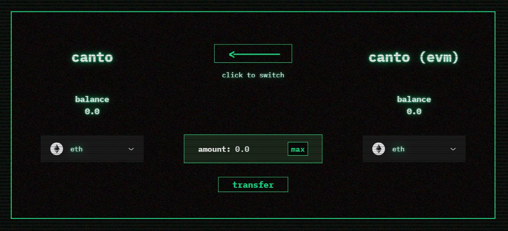

# Converting Assets

**There are two Canto ledgers: native Canto and the Canto EVM.** Depending on what you want to do on Canto, you may need to convert assets from one chain to the other**.**

If you have just bridged from Ethereum or Cosmos, your assets are on the native Canto blockchain. To use the Canto Lending Market, Canto DEX, and other DApps, you must convert your assets to the Canto EVM:

* [Native Canto -> Canto EVM](converting-assets.md#canto-native-greater-than-canto-evm)

If your assets are already on the Canto EVM but you would like to bridge them back to Ethereum or Cosmos, you must first convert them to the native Canto blockchain:

* [Canto EVM -> Native Canto](converting-assets.md#canto-evm-greater-than-canto-native)

## Native Canto -> Canto EVM 


**To convert assets from native Canto to Canto EVM, you must have at least 0.3 $CANTO in your MetaMask wallet.** If necessary, you can request a drip from the #social-faucet channel in the [Canto Discord](https://discord.com/invite/canto).


To convert assets from native Canto to the Canto EVM, follow these steps:

1. Navigate to [**convert.canto.io**](https://convert.canto.io) and connect your MetaMask wallet, making sure you are on the Canto network.
2. Select the token you would like to convert and input the quantity. Quantities less than 1 must include a 0 in the ones place value (e.g. `0.99`).
3. Make sure the arrow is pointing **left to right**, showing the flow of assets from Canto Native to Canto EVM.
4. Click `transfer` and sign the message in your wallet.

## Canto EVM -> Native Canto 

To convert assets from the Canto EVM to native Canto, follow these steps:

1. Navigate to [**convert.canto.io**](https://convert.canto.io/) and connect your MetaMask wallet, making sure you are on the Canto network.
2. **Click on the arrow to toggle the flow of assets from Canto EVM to Canto Native.**
3. Select the token you would like to convert and input the quantity. Quantities less than 1 must include a 0 in the ones place value (e.g. `0.99`).
4. Make sure the arrow is pointing **right to left**, showing the flow of assets from Canto EVM to Canto native.
5. Click `transfer` and sign the message in your wallet.

