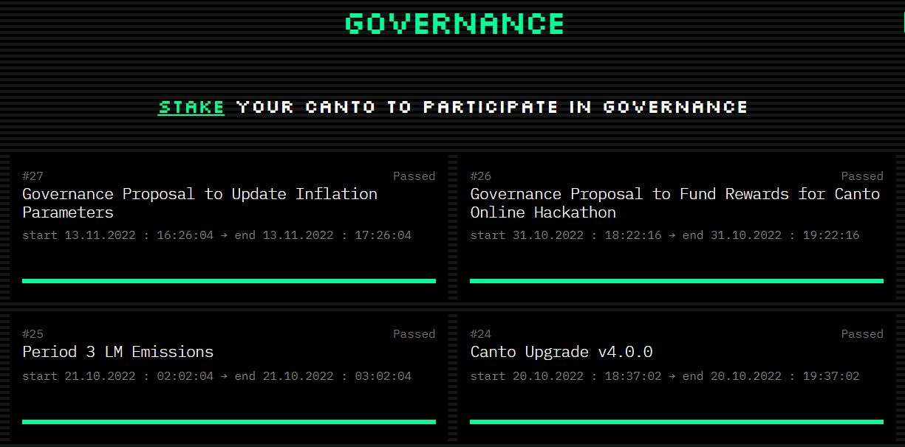

# Governance

The Canto governance page at [**v2.app.canto.io/governance**](https://app.canto.io/governance) is a place where all users who have staked Canto can vote on proposals. This allows you to contribute to the blockchain and place votes on changes that will directly impact the Canto community.

<figure><figcaption></figcaption></figure>

### Proposals

When entering the governance page, a list of all completed and ongoing proposals are shown. The title of the proposal, start time, end time, and a bar representing the current votes is shown in each block. For more information on each proposal, click on the proposal and a modal will open.&#x20;

<figure><figcaption></figcaption></figure>

In the proposal modal, you can see more in depth information about the proposal including the description, individual vote count, and thresholds for the proposal. If the vote has ended, the modal will show `voting has ended` and you will not be able to vote.

### Voting

If the proposal is still ongoing, and you have staked canto at staking.canto.io, you are eligible to vote on the active proposal. You will see 4 options to choose from when voting, `yes`, `no`, `veto`, and `abstain`.

After selecting an option, click `vote` and sign the transaction in your wallet:

After signing the vote, you will see a success message and the screen will refresh with your new vote added to the proposal.&#x20;
