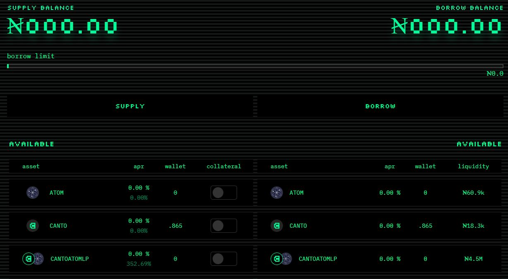
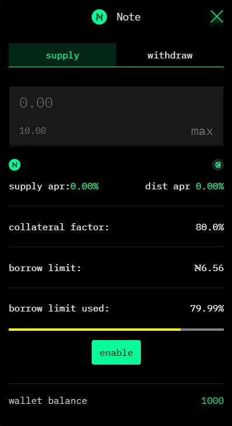
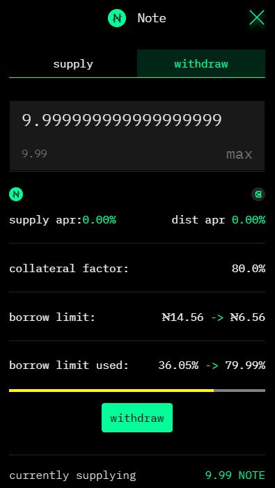
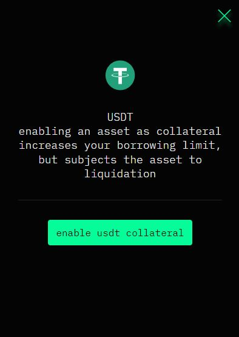
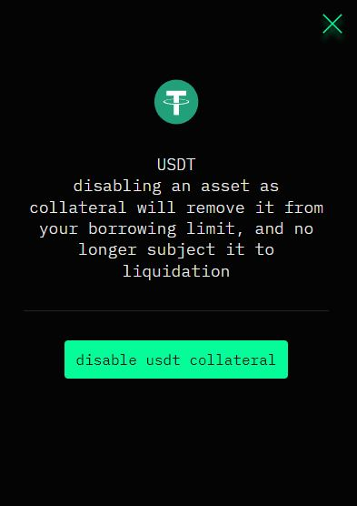
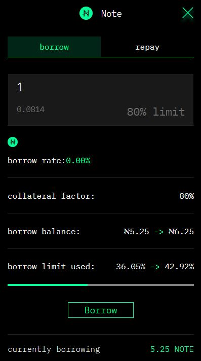
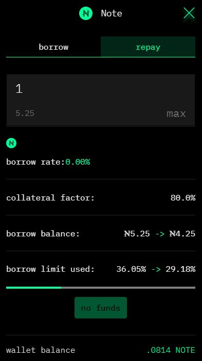

# Lending & Borrowing

The Canto Lending Market at [**canto.io/lending**](https://canto.io/lending) allows users to lend and borrow assets. At this time eligible collateral assets include USDC and USDT, but new collateralization assets such as LP tokens will be added to maximalize capital efficiency.

<figure><figcaption></figcaption></figure>

## Supplying Tokens

To supply an asset to the Canto Lending Market, follow these steps:

1. On the [**canto.io/lending**](https://canto.io/lending) homepage, click on an asset in the _Supply_ column.
2. Enter the quantity of the asset you wish to supply. If necessary, approve the token's transfer.
3. Click "Supply" and confirm the transaction in your wallet.

<figure><figcaption></figcaption></figure>

Once the transaction has been mined, asset-specific cTokens will be minted to your wallet. These tokens represent your lending position and are automatically burnt when withdrawing the supplied asset.

### Withdrawing Supply

To withdraw a supplied asset from the Canto Lending Market, follow these steps:

1. On the [**canto.io/lending**](https://canto.io/lending) **** homepage, click on the asset in the _Supply_ column.
2. Switch to the `withdraw` tab and enter the quantity of the asset you wish to withdraw.
3. Click "Withdraw" and confirm the transaction in your wallet.

<figure><figcaption></figcaption></figure>

If you have open borrow positions, note that you will not be able to withdraw if the hypothetical `borrow limit used` exceeds 100%, as this would result in liquidation.

## Collateralizing

In order to borrow an asset from the Canto Lending Market, you must collateralize your supply positions. The amount you can borrow is directly related to the collateral factor of each specific token and how much you have supplied in the market.

To collateralize an asset, follow these steps:

1. On the [**canto.io/lending**](https://canto.io/lending) **** homepage, locate the asset in the _Supply_ column.
2. Click on the collateral switch for that asset.
3. In the modal that opens, click "enable asset collateral" and confirm the transaction in your wallet.

<figure><figcaption></figcaption></figure>

### Decollateralizing

To decollateralize an asset, follow these steps:

1. On the [**canto.io/lending**](https://canto.io/lending) **** homepage, locate the asset in the _Supply_ column.
2. Click on the collateral switch for that asset.
3. In the modal that opens, click "disable asset collateral" and confirm the transaction in your wallet.

<figure><figcaption></figcaption></figure>

This button is disabled if decollateralizing the asset would put you above 80% of your borrow limit, since this could lead to liquidation.

## Borrowing

In order to borrow an asset, there must be enough supply in the Canto Lending Market to borrow against. To do so, follow these steps:

1. On the [**canto.io/lending**](https://canto.io/lending) **** homepage, click on an asset in the _Borrow_ column.
2. Enter the quantity of the asset you wish to borrow.
3. Click "Borrow" and confirm the transaction in your wallet.

<figure><figcaption></figcaption></figure>

Note that it is possible to manually enter a borrow amount whereby the `borrow limit used` exceeds 80%, but this is not advisable due to liquidation risk.

### Repaying Borrows

To repay a borrowed asset, follow these steps:

1. On the [**canto.io/lending**](https://canto.io/lending) **** homepage, click on an asset in the _Borrow_ column.
2. Switch to the `repay` tab and enter the quantity of the asset you wish to repay. If necessary, approve the token's transfer.
3. Click "Repay" and confirm the transaction in your wallet.

<figure><figcaption></figcaption></figure>

## Claiming LM Rewards

To claim liquidity mining rewards, click on `claim LM rewards` on the [**canto.io/lending**](https://canto.io/lending) **** homepage. Then, click "Claim" and confirm the transaction in your wallet.


Liquidity mining rewards are paid out in $WCANTO, the wrapped ERC20 equivalent of $CANTO. You can unwrap $WCANTO or trade with it directly on third-party DEX interfaces such as [Slingshot](https://app.slingshot.finance/swap/CANTO).

