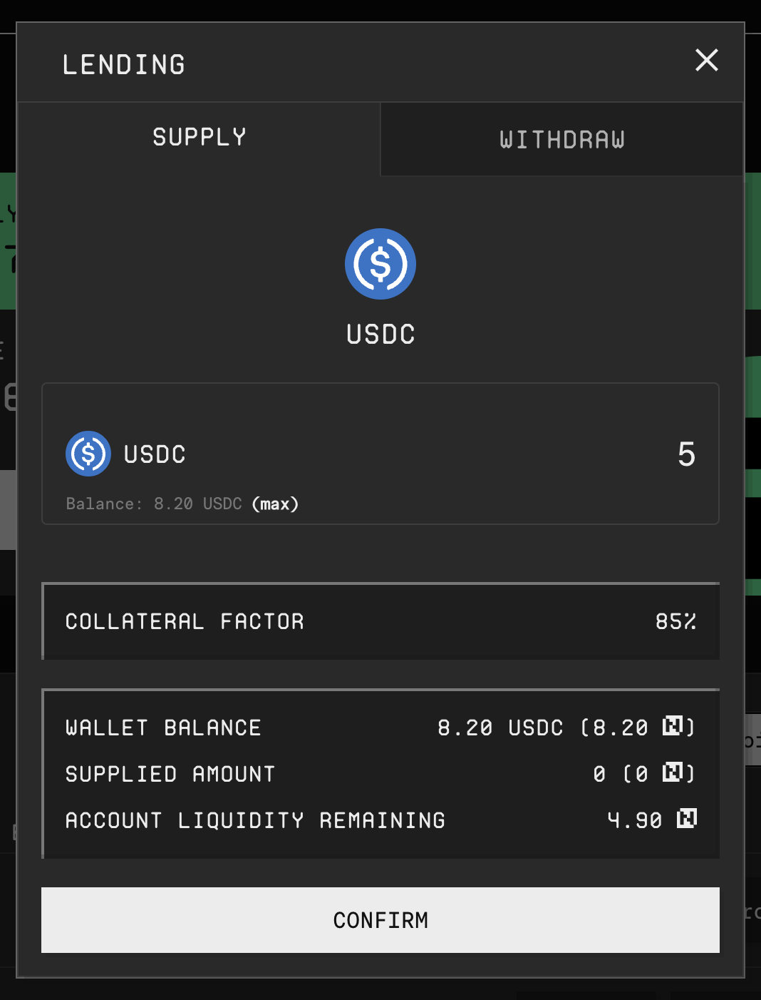
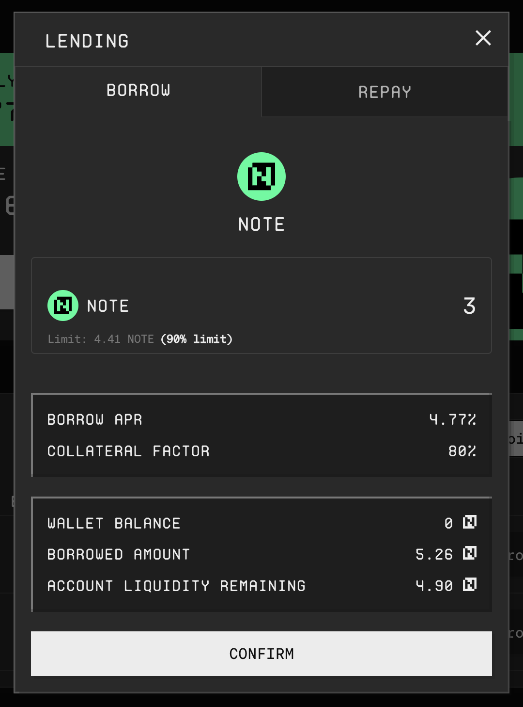

# Lending & Borrowing

The Canto Lending Market at [**canto.io/lending**](https://canto.io/lending) allows users to lend and borrow assets. Currently, USDC, USDT, and NOTE can be supplied to and borrowed from the Canto Lending Market. Additionally, [USYC](https://docs.canto.io/neofinance/overview#rwas) can be supplied.

## Supplying Tokens

To supply an asset to the Canto Lending Market, follow these steps:

1. On the [**canto.io/lending**](https://canto.io/lending) homepage, click `SUPPLY NOTE`. For other assets, click `Supply` in the `RWAs` or `Stablecoins` tab.
2. Enter the quantity of the asset. If necessary, approve the token's transfer.
3. Click `Confirm` and confirm the transaction in your wallet.

<figure><figcaption></figcaption></figure>

Once the transaction has been mined, asset-specific cTokens will be minted to your wallet. These tokens represent your lending position and are automatically burnt when withdrawing the supplied asset.

### Withdrawing Supplied Assets

To withdraw a supplied asset from the Canto Lending Market, follow these steps:

1. On the [**canto.io/lending**](https://canto.io/lending) homepage, click `SUPPLY NOTE`. For other assets, click `Supply` in the `RWAs` or `Stablecoins` tab.
2. Switch to the `Withdraw` tab and enter the quantity of the asset you wish to withdraw.
3. Click `Confirm` and confirm the transaction in your wallet.

If you have open borrow positions, note that you will not be able to withdraw if the hypothetical borrow limit usage exceeds 100%, as this would result in liquidation.

## Borrowing

In order to borrow an asset, there must be enough supply in the Canto Lending Market to borrow against. To do so, follow these steps:

1. On the [**canto.io/lending**](https://canto.io/lending) homepage, click `BORROW NOTE`. For other assets, click `Borrow` in the `Stablecoins` tab.
2. Enter the quantity of the asset you wish to borrow.
3. Click `Confirm` and confirm the transaction in your wallet.

<figure><figcaption></figcaption></figure>

Note that it is possible to manually enter a borrow amount whereby the `borrow limit used` exceeds 80%, but this is not advisable due to liquidation risk.

### Repaying Borrows

To repay a borrowed asset, follow these steps:

1. On the [**canto.io/lending**](https://canto.io/lending) homepage, click `BORROW NOTE`. For other assets, click `Borrow` in the `Stablecoins` tab.
2. Switch to the `Repay` tab and enter the quantity of the asset you wish to repay.
3. Click `Confirm` and confirm the transaction in your wallet.
