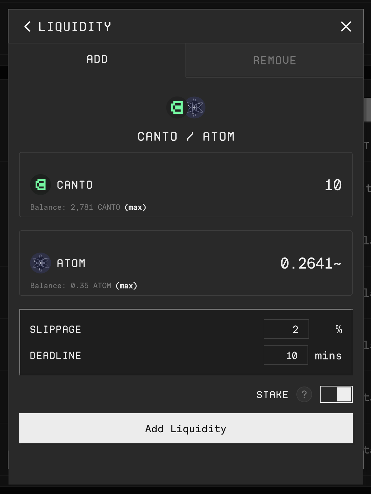
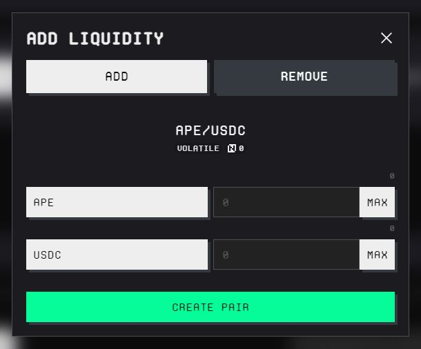
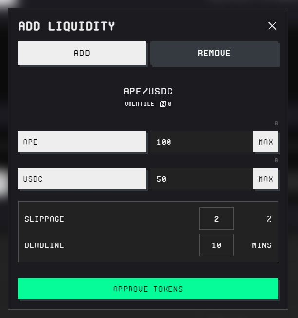

# Providing Liquidity

The [**canto.io**](https://canto.io/) frontend offers two interfaces for providing liquidity on the Canto DEX and Ambient:

* [**canto.io/lp**](https://canto.io/lp) – for incentivized pairs
* [**pools.canto.io**](https://pools.canto.io/) – for all other pairs


To swap tokens through the Canto DEX or Ambient, use a third-party frontend or aggregator such as [Slingshot](https://app.slingshot.finance/trade/ETH).


## [canto.io/lp](https://canto.io/lp)

This interface is used to provide liquidity to any of Canto's incentivized liquidity pools. At the time of writing, these include the following:

* CANTO/NOTE (Canto DEX, volatile)
* CANTO/ETH (Canto DEX, volatile)
* CANTO/ATOM (Canto DEX, volatile)
* NOTE/USDC (Canto DEX, stable)
* NOTE/USDT (Canto DEX, stable)
* cNOTE/USDC (Ambient)
* NOTE/USDC (Ambient)

### Add Liquidity

In order to add liquidity to a pool using the LP interface:

1. Click on the `Add LP` button next to a pool and select `Manage LP`.
2. Enter how much liquidity you wish to provide, and click the `Add Liquidity` button.
3. Confirm the transactions in your wallet.

<figure><figcaption></figcaption></figure>

Liquidity tokens are automatically deposited to the Canto Lending Market ("staked") to earn liquidity incentives.

### Remove Liquidity

In order to remove liquidity from a pool using the LP interface:

1. Click on the `Manage LP` button next to a pool and select `Manage LP`.
2. Navigate to the `REMOVE` tab.
3. Enter how much liquidity you wish to remove, and click the `Remove Liquidity` button.
4. Confirm the transactions in your wallet.

## [**pools.canto.io**](https://pools.canto.io/)

This interface is used to create or provide liquidity to pools on the Canto DEX.

### Create a Pool

<figure><figcaption></figcaption></figure>

1. Click on the `Create a Pair` button.
2. Select the assets.
3. Sign the transactions in your wallet to create the pair.
4. Optionally, follow the steps below to add liquidity.

### Add Liquidity

<figure><figcaption></figcaption></figure>

1. Click on the `ADD LP` button next to a pool or create a new pair as above.
2. Enter how much liquidity you wish to provide. For a new pair, the amounts of each asset will determine the starting price.
3. Click on the `APPROVE TOKENS` button and confirm the transactions in your wallet.
4. Finally, click on the `ADD LP` button and confirm the transactions in your wallet.

### Remove Liquidity

1. Click on the `ADD LP` button next to a pool and select the `REMOVE` tab.
2. Enter how much liquidity you wish to remove.
3. Click on the `REMOVE LP` button and confirm the transactions in your wallet.
