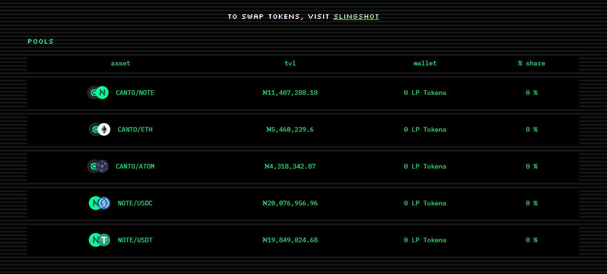
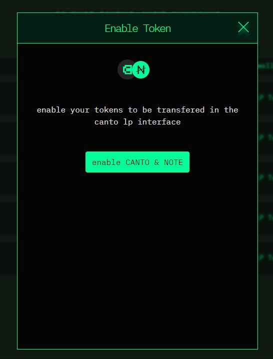
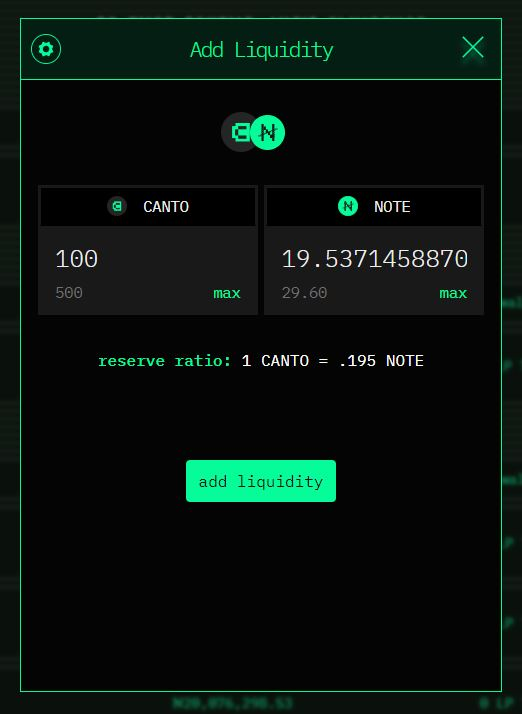
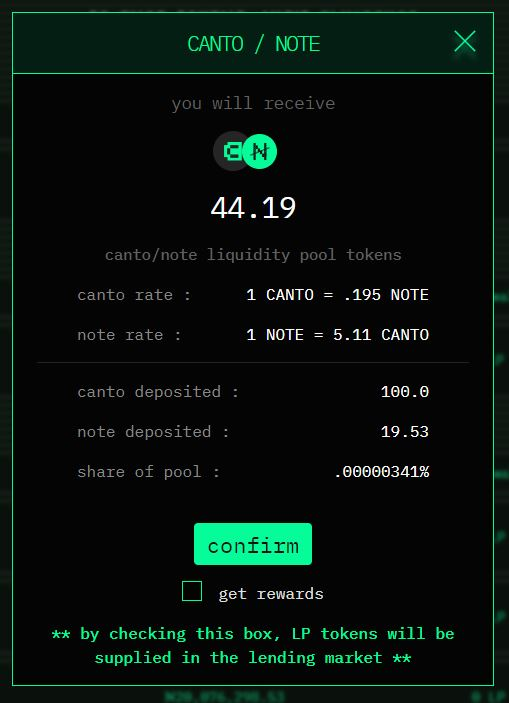
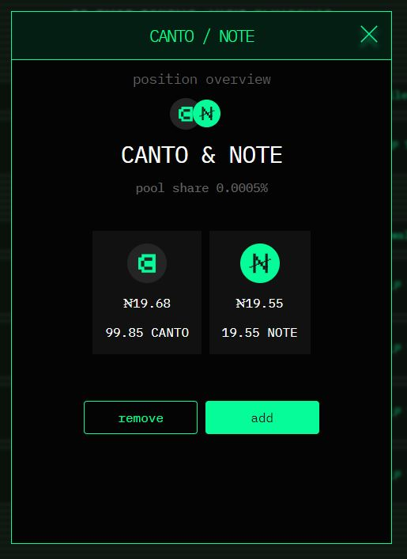
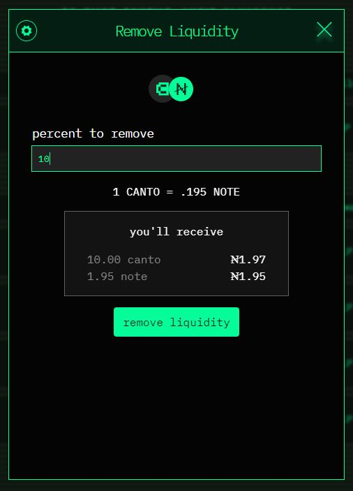
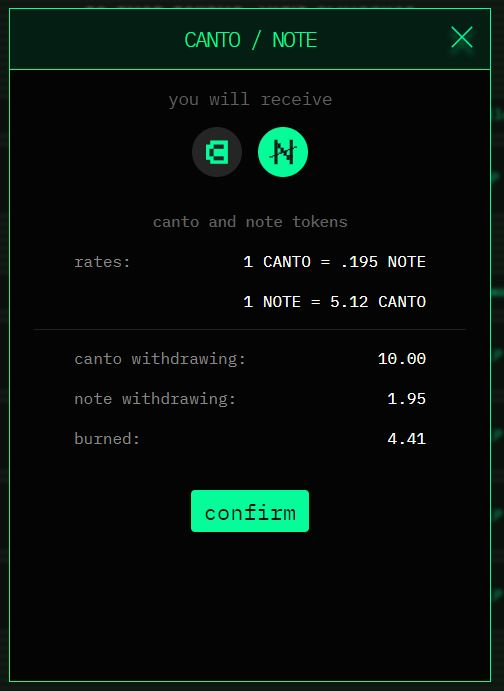

# Providing Liquidity

The Canto LP interface at [**canto.io/lp**](https://canto.io/lp) allows users to provide liquidity and receive LP tokens. At launch, Canto has five incentivized liquidity pools which can be found on this page:

* CANTO/NOTE
* CANTO/ETH
* CANTO/ATOM
* NOTE/USDC
* NOTE/USDT

<figure><figcaption></figcaption></figure>


The Canto LP interface does not allow users to swap tokens through the Canto DEX. To interact with the Canto DEX, use a third-party frontend or aggregator such as [Slingshot](https://app.slingshot.finance/trade/ETH).


### Add Liquidity

In order to add liquidity to the Canto LP Interface:&#x20;

1. Click on the pool you would like to add liquidity to. If necessary, enable the constituent tokens:

<figure><figcaption></figcaption></figure>

2\. After completing the enable transaction, enter how much liquidity you wish to provide, and click the "add liquidity" button:

<figure><figcaption></figcaption></figure>

3\. Next, verify the details of the deposit and confirm the transaction:

<figure><figcaption></figcaption></figure>

### Remove Liquidity

In order to remove liquidity from the Canto LP Interface:&#x20;

1. Select the pool that you wish to remove liquidity from. Then click the "remove" button:

<figure><figcaption></figcaption></figure>

2\. Enable the Canto network to remove liquidity from that specific pool.

3\. Enter the percent of liquidity you wish to remove, and click the remove liquidity button.

<figure><figcaption></figcaption></figure>

4\. You will then see details about the transaction. Once you are certain you want to make this transaction, click "confirm":

<figure><figcaption></figcaption></figure>

