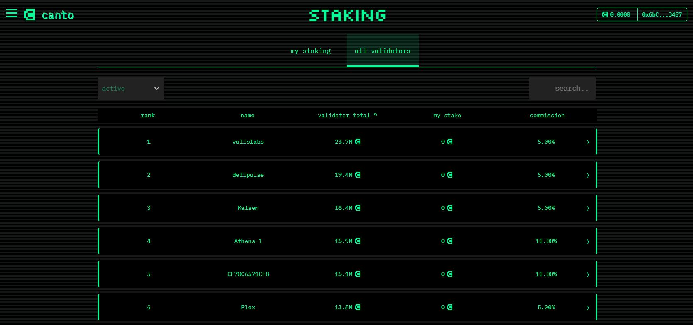
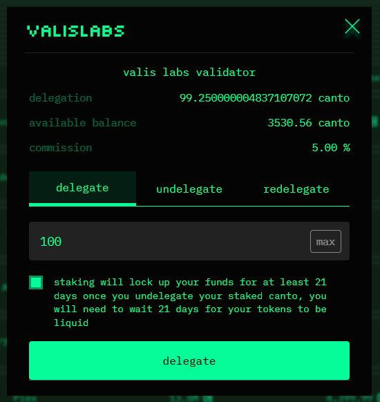
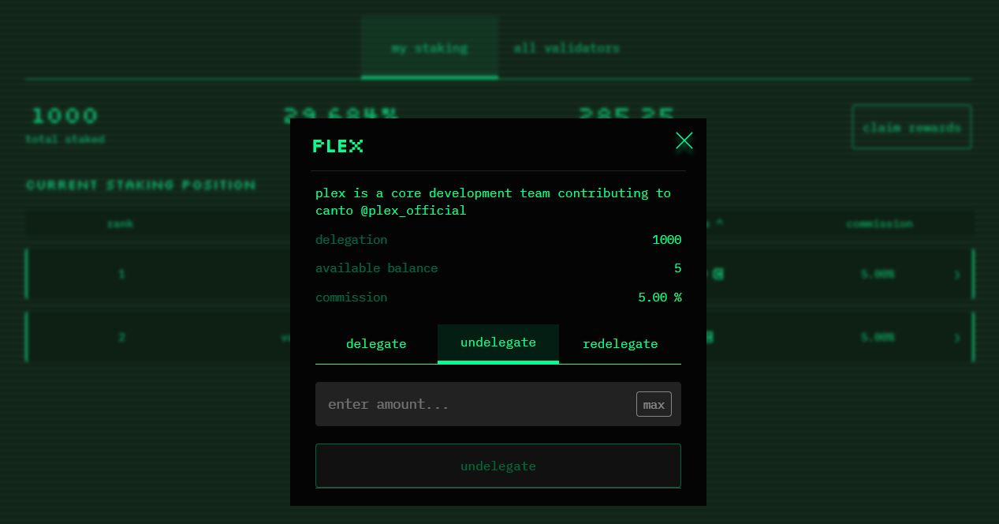

# Staking

Staking, also known as delegating, is the process of locking up your $CANTO tokens for a period of time to contribute to the security of the Canto network.

In exchange for locking up your tokens, you'll earn rewards in the form of additional $CANTO, as well as voting power for governance proposals.


Staked tokens are subject to a **21 day unbonding period**. If you decide to unstake $CANTO, you will have to wait 21 days before it returns to your wallet.


## How to Stake

Follow these steps to stake your $CANTO:

1. Navigate to [**v2.canto.io/staking**](https://canto.io/staking) and connect your wallet.
2.  Click on the "all validators" tab to see a list of network validators:\

    <figure><figcaption></figcaption></figure>
3.  Click on the validator you would like to stake with:\

    <figure><figcaption></figcaption></figure>
4. Enter the amount of $CANTO you would like to stake and click "delegate".
5. Confirm the transaction in your wallet.

## Claiming Rewards

1. Navigate to [**canto.io/staking**](https://canto.io/staking) and connect your wallet.
2. Click on "claim rewards" and confirm the transaction in your wallet.

Note: You must claim rewards separately for every validator you have delegated to.

<figure><figcaption></figcaption></figure>

## Re-Delegating

You may wish to move your stake between validators without subjecting yourself to the unbonding period. This can be done by re-delegating your stake:

1. Navigate to [**v2.canto.io/staking**](https://canto.io/staking) and connect your wallet.
2. Click on the delegation you would like to re-delegate.
3. On the "redelegate" tab, choose the validator you would like to re-delegate to and enter the amount.
4. Click on "re-delegate" and confirm the transaction in your wallet.


You can only re-delegate from an account once every 21 days.


## How to Unstake

Follow these steps to unstake your $CANTO:

1. Navigate to [**v2.canto.io/staking**](https://canto.io/staking) and connect your wallet.
2. Click on the delegation you would like to unstake.
3. On the "undelegate" tab, enter the amount you would like to undelegate.
4. Click on "undelegate" and confirm the transaction in your wallet.

When you unstake tokens, they will be subject to a 21 day unbonding period. You can see the progress of any unbonding accounts at the bottom of the staking homepage.

<figure><figcaption></figcaption></figure>

**Note**: You can only have 7 concurrent undelegations at a time for each validator. In other words, you can unstake 7 times from a given validator within a 21 day period.

## Risks (Slashing)

Staking $CANTO is not without risk. By delegating tokens to a validator, you assume some responsibility for their behavior, proportionally to the size of your stake.

If a validator misbehaves, any tokens delegated to them will be [slashed](https://docs.canto.io/technical-reference/validators/slashing) by:

* 0.75% in the case of prolonged downtime
* 4% in the case of consensus faults

Due to slashing, performing due diligence on validators before staking any tokens and splitting your stake across multiple validators is highly recommended.

Aside from slashing, staked tokens are subject to a 21 day unbonding period from the moment they are unstaked, as previously mentioned. During this time, you will not be able to access your tokens.
